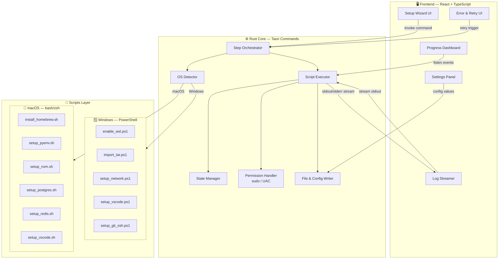
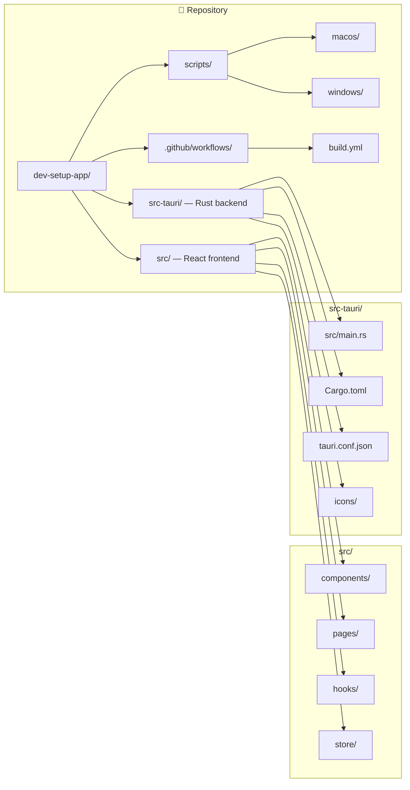
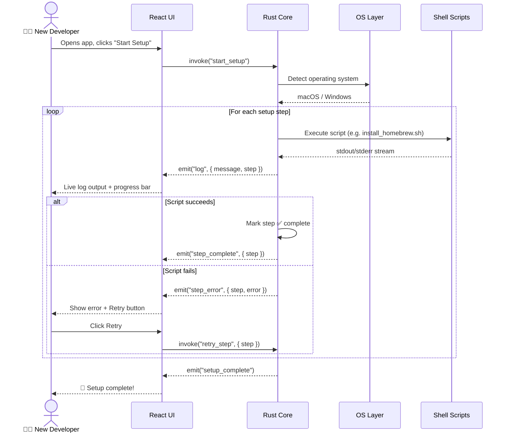
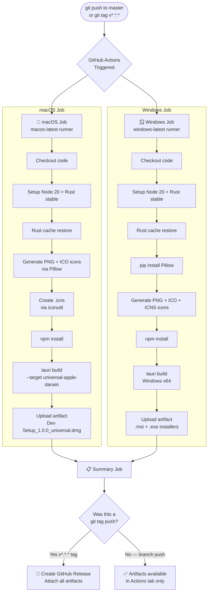
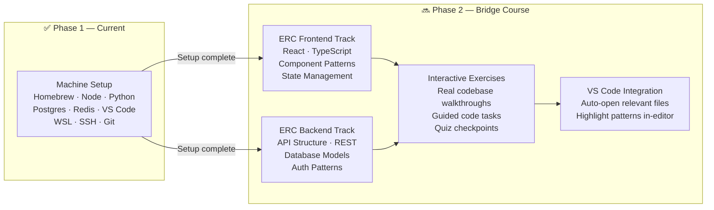
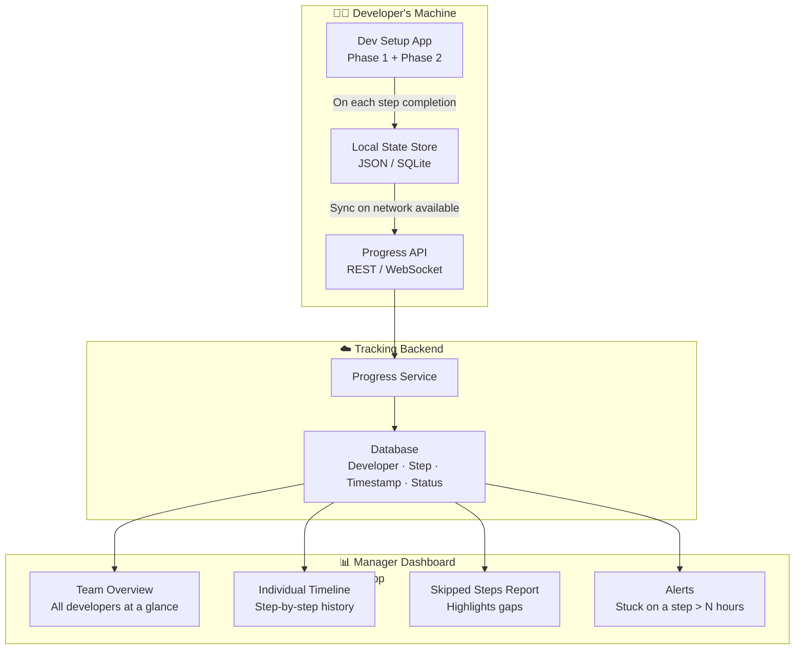
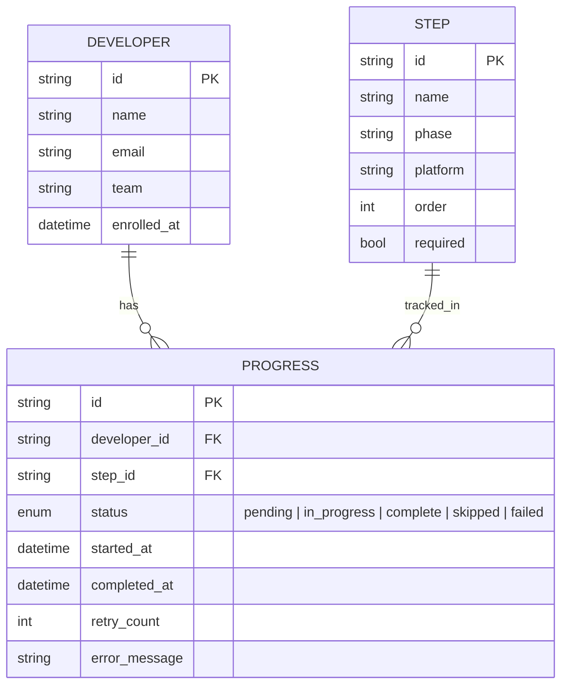
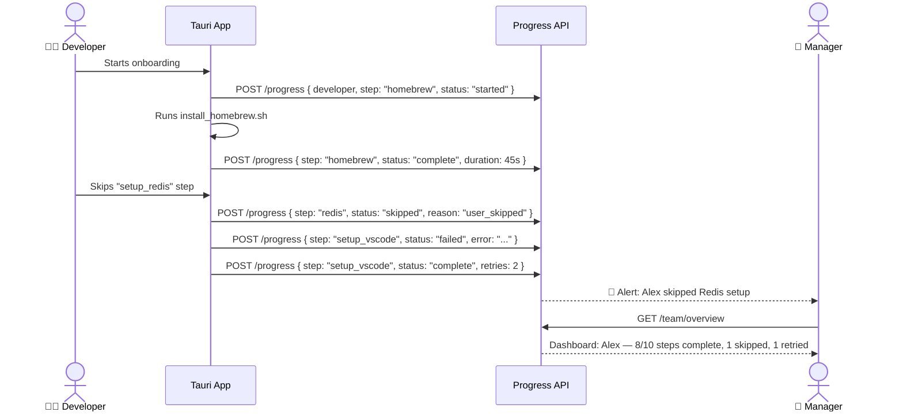
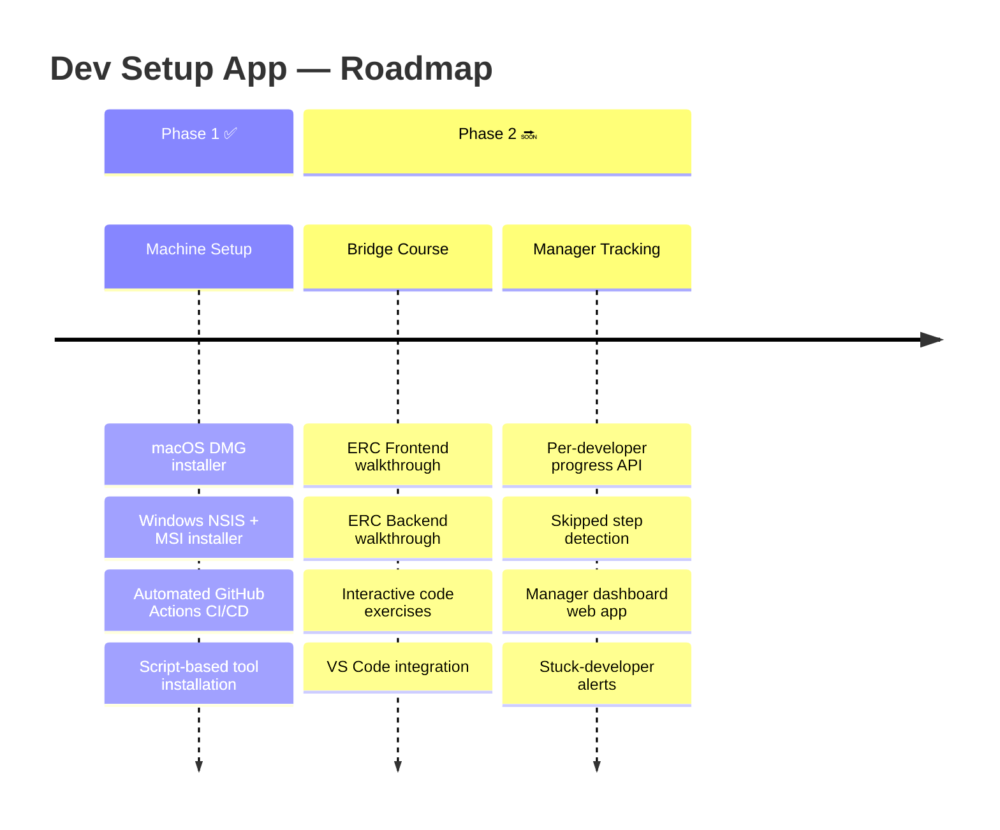

# Dev Setup App — Architecture & Documentation

> **Cross-platform developer environment installer built with Tauri (Rust + React)**
> Current phase: POC / Phase 1

---

## Table of Contents

1. [Overview](#overview)
2. [Architecture](#architecture)
3. [Application Structure](#application-structure)
4. [Execution Flow](#execution-flow)
5. [Scripts Layer](#scripts-layer)
6. [CI/CD Pipeline](#cicd-pipeline)
7. [Pros & Cons](#pros--cons)
8. [Phase 2 — ERC Framework Bridge Course](#phase-2--erc-framework-bridge-course)
9. [Phase 2 — Manager Onboarding Tracking Dashboard](#phase-2--manager-onboarding-tracking-dashboard)

---

## Overview

The **Dev Setup App** automates the entire developer environment setup process for new engineers joining the team. Instead of following a 20-page manual document, a new developer simply downloads and runs a single installer that provisions their machine end-to-end.

| | |
|---|---|
| **Platforms** | macOS (Universal DMG) · Windows (NSIS `.exe` + MSI) |
| **Stack** | Tauri v1 · Rust · React · TypeScript · Vite |
| **Installer size** | ~10–20 MB |
| **Build** | GitHub Actions (free tier, personal account) |

---

## Architecture



---

## Application Structure



---

## Execution Flow



---

## Scripts Layer

### macOS Scripts

| Script | Purpose |
|---|---|
| `install_homebrew.sh` | Install Homebrew package manager |
| `setup_pyenv.sh` | Install pyenv + Python version management |
| `setup_nvm.sh` | Install nvm + Node.js LTS |
| `setup_postgres.sh` | Install & initialise PostgreSQL via Homebrew |
| `setup_redis.sh` | Install & start Redis via Homebrew |
| `setup_vscode.sh` | Install VS Code + recommended extensions |

### Windows Scripts

| Script | Purpose |
|---|---|
| `enable_wsl.ps1` | Enable WSL2 feature + set default version |
| `import_tar.ps1` | Import pre-configured Ubuntu `.tar` into WSL |
| `setup_network.ps1` | Configure proxy, DNS, and network settings |
| `setup_vscode.ps1` | Install VS Code + WSL extension + dev extensions |
| `setup_git_ssh.ps1` | Generate SSH key pair + configure git globals |

---

## CI/CD Pipeline



### Triggering a Public Release

```bash
# Tag and push to create a GitHub Release with download links
git tag v1.0.0
git push personal v1.0.0
```

This creates a public release at:
`https://github.com/brandondsouza347-design/dev-setup-app/releases`

### Workflow Inputs (Manual Trigger)

The workflow supports `workflow_dispatch` for manual runs with these options:

| Input | Options | Default |
|---|---|---|
| `platforms` | `all`, `macos-only`, `windows-only` | `all` |
| `publish` | `true`, `false` | `false` |

---

## Pros & Cons

### ✅ Pros

| Benefit | Detail |
|---|---|
| **Tiny installer** | ~10–20 MB — no bundled browser engine (unlike Electron ~150 MB) |
| **Fast startup** | Rust binary starts instantly, no V8 warm-up |
| **Secure** | Tauri's allowlist model — frontend can only call explicitly permitted Rust commands |
| **Native OS integration** | Rust has direct access to filesystem, processes, permissions (sudo/UAC) |
| **Real log streaming** | Rust streams stdout/stderr from scripts in real-time to the UI |
| **Cross-platform single codebase** | One React UI, one Rust core — OS differences handled in scripts layer only |
| **Maintainable scripts** | Shell/PowerShell scripts are easy to update without recompiling the app |
| **Free CI/CD** | GitHub Actions free tier builds both platforms automatically on every push |
| **Retry logic** | Failed steps can be retried without restarting the entire setup |

### ❌ Cons

| Limitation | Detail |
|---|---|
| **Rust learning curve** | Tauri commands and async Rust require Rust knowledge to extend |
| **No Linux support** | Dropped intentionally — team uses macOS and Windows only |
| **Longer initial build** | First Rust compile takes ~2–3 min (subsequent builds use cache) |
| **Script maintenance** | macOS/Windows scripts must be kept in sync as tooling versions evolve |
| **No code signing** | Currently unsigned — macOS Gatekeeper and Windows SmartScreen will warn users |
| **No auto-update** | Tauri updater is disabled — new versions require re-download |
| **Registry files read-only** | Cargo registry crates are read-only; patching wry for webkit2gtk compat requires chmod workaround |

---

## Phase 2 — ERC Framework Bridge Course

> **Goal:** After a developer's machine is set up, guide them through the ERC (Epicor Reference Client) codebase — both frontend and backend — so they can contribute confidently within their first week.



### What Phase 2 Covers

#### Frontend Track
- ERC component library — how components are structured and named
- State management patterns used in the codebase
- How to find and read existing components before building new ones
- TypeScript conventions specific to the ERC frontend
- How to run the frontend locally and connect to a dev API

#### Backend Track
- ERC API architecture — routing, middleware, controllers
- Database models and migration patterns
- Authentication and authorisation flow
- How to run the backend locally with a seeded database
- How to write and run backend tests

#### Delivery Format (Planned)
- Embedded in the same Tauri app — new tab after Phase 1 completes
- Step-by-step guided lessons with real code snippets from the ERC repo
- Each lesson has a completion checkpoint (quiz, code task, or acknowledgement)
- Progress saved locally and synced to a central tracking backend (see Phase 2 Tracking below)

---

## Phase 2 — Manager Onboarding Tracking Dashboard

> **Goal:** Give team leads and managers full visibility into each developer's onboarding progress — what's been completed, what's been skipped, and where someone is stuck.



### Tracking Data Model (Planned)



### Manager Dashboard Features (Planned)

| Feature | Description |
|---|---|
| **Team Overview** | Grid of all developers with overall % complete, colour-coded by status |
| **Individual Timeline** | Full step-by-step history for one developer with timestamps |
| **Skipped Steps** | Highlight which required steps were skipped and why |
| **Stuck Alert** | Notify manager when a developer has been on the same step for > 2 hours |
| **Completion Report** | Export CSV/PDF of team onboarding status for a sprint or cohort |
| **Retry Heatmap** | Show which setup steps fail most often across the team — feeds back into script improvements |

### End-to-End Tracking Flow



---

## Summary



---

*Built with [Tauri](https://tauri.app) · [React](https://react.dev) · [Rust](https://www.rust-lang.org)*
*CI/CD via [GitHub Actions](https://github.com/features/actions)*
